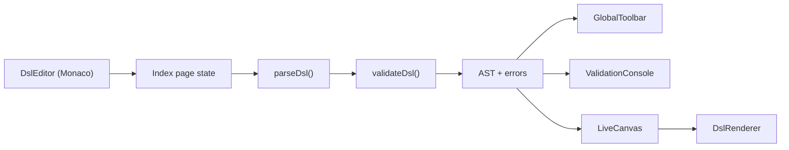

# Architecture Overview

## System Shape

This is a single-page React application built with Vite. The product is centered on one workflow: author a strictly structured DSL in Monaco, validate it, convert it to an AST, and render the resulting UI immediately.

## Runtime Flow

1. `Index` owns the authoritative page state: `dsl`, `mode`, `ast`, `errors`, and `lastValidAst`.
2. Every DSL change triggers parsing and validation.
3. The canvas renders the current AST when valid, or the last valid AST while errors are present.
4. The toolbar is a thin control surface over page state.

## Architectural Boundaries

- `src/pages/`: screen composition and state orchestration
- `src/components/`: app-specific view components
- `src/components/ui/`: shared generated UI primitives
- `src/lib/`: pure logic and reusable project utilities
- `src/test/`: test setup and current test files

## Important Characteristics

- The DSL is runtime-validated, not compile-time validated.
- The renderer is direct and synchronous. There is no backend or persistence layer.
- Routing exists only as app shell plumbing. The product itself currently lives on `/`.
- Styling is token-based Tailwind over CSS variables defined in [`src/index.css`](../../src/index.css).
- The app is intentionally deterministic. It is not meant to interpret free-form text or generate UI through AI inference.
